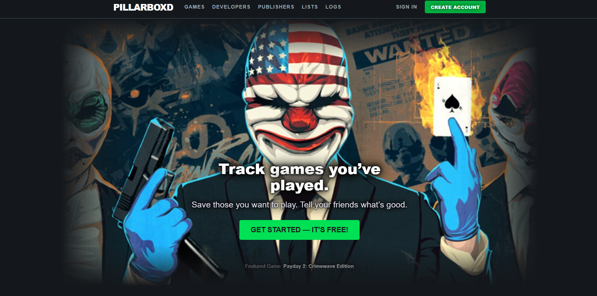

  

---

<div align="center">


</div>

---

<div align="center">
    
</div>

## What is Pillarboxd?
Pillarboxd is a fullstack application made in Ruby on Rails to showcase complex database relationships amongst video games.  
Our team decided to make a video game reviewing and logging application that can be used to show your friends what games you have been playing!

---

## Running the project

Install [docker compose](https://docs.docker.com/compose/install/)

Then run

```bash
docker-compose up -d --build # wait until it downloads everything and starts the containers
docker exec -it rails_web bundle exec rails db:migrate:reset --trace # to create the schema for the db
docker exec -it rails_web bundle exec rails db:seed --trace # seed the database with data
```

The web server and db are already up and running. Database is at localhost:3306 and server is at localhost:3000

### Updating and/or Reseeding the Database
```bash
docker exec -it rails_web bundle exec rails db:reset
```

### Anytime Gemfile or core files are changed...
Core volumes have changed and need to delete cache for new container builds
```bash
docker-compose down --volumes
# Repeat steps above for install
```

## Contributors
[](https://github.com/bogdicatana)
[](https://github.com/cl-py)
[](https://github.com/edmuri)
[](https://github.com/martingaw11)
[](https://github.com/itsperi)
[](https://github.com/Vidhi003)
